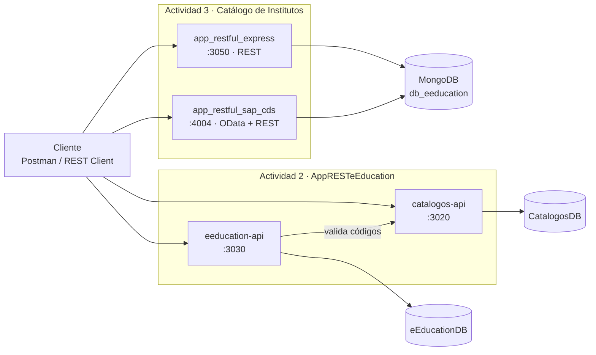

# Laboratorio de Servicios Web — Equipo 4

Código y guías de la materia **Laboratorio de Servicios Web** (ISC, Instituto Tecnológico de Tepic, grupo 5A).
Unidad 1: *Infraestructura Web REST API*.

> ¿Primera vez aquí? Empieza por [docs/00-empieza-aqui.md](docs/00-empieza-aqui.md).

---

## Bajar los últimos cambios

```bash
git checkout main
git pull origin main
```

Si trabajas en tu rama y quieres traerte lo nuevo de `main`:

```bash
git checkout tu-rama
git merge main
```

Cada proyecto tiene sus propias dependencias, así que después de un `pull` que toque
`package.json` hay que reinstalar **dentro de la carpeta del proyecto**:

```bash
cd app_restful_express   # o el proyecto que vayas a correr
npm install
```

---

## Qué hay en el repositorio

El repo está organizado **por actividad**. Cada carpeta de proyecto es independiente: tiene su
`package.json`, su `.env`, su puerto y su README. No hay que instalar nada en la raíz.

### Actividad 2 — Anteproyecto y APIs base

El docente dejó dos líneas de trabajo según la experiencia de cada integrante.

| Carpeta | Para quién | Qué es | Puerto |
|---|---|---|---|
| [`catalogos-api/`](catalogos-api) | Integrantes que **ya llevaron clase** con el docente | Catálogo de catálogos (etiquetas → valores con N niveles) | 3020 |
| [`eeducation-api/`](eeducation-api) | Integrantes **nuevos** | *AppRESTeEducation*: Institutos y Productos/Servicios | 3030 |

Son independientes (cada una arranca sola), pero se conectan entre sí: `eeducation-api` valida sus
códigos (giro, estatus, tipo de producto, tipo de archivo) preguntándole a `catalogos-api`. Ese es
el ejemplo de **comunicación entre microservicios** del proyecto.

### Actividad 3 — El mismo proceso DEMO en dos frameworks

El encargo fue construir el CRUD del **Catálogo de Institutos** dos veces, en dos plataformas
distintas, para poder compararlas. Ambos proyectos apuntan a la **misma base de datos y a la misma
colección**, así que sus respuestas se pueden poner una al lado de la otra.

| Carpeta | Framework | Qué expone | Puerto |
|---|---|---|---|
| [`app_restful_express/`](app_restful_express) | Express / JavaScript | REST/JSON + Swagger UI | 3050 |
| [`app_restful_sap_cds/`](app_restful_sap_cds) | SAP CDS (CAP) / NodeJS | OData V4 **y** REST plano + Swagger UI | 4004 |

### Apoyo

| Carpeta | Qué es |
|---|---|
| [`database/`](database) | Docker con Mongo (27018) y PostgreSQL (5433) locales, esquema SQL, datos de prueba y vistas |
| [`docs/`](docs) | Guías paso a paso, diseño de datos y flujo de trabajo en Git |



---

## Inicio rápido

Requisitos: **Node.js 22+**, **Git** y una cuenta de MongoDB Atlas *o* Docker para trabajar local.
Para `app_restful_sap_cds` hace falta además el CLI de SAP: `npm install -g @sap/cds-dk`.

```bash
git clone https://github.com/BetoCW/lab-servicios-web.git
cd lab-servicios-web/app_restful_express   # o cualquier otro proyecto
npm install
cp .env.example .env                       # Windows: copy .env.example .env  -> y llena tus datos
npm run seed                               # carga los datos de prueba
npm run dev                                # levanta el servidor
```

Cada proyecto dice en su propio README qué URL abrir. Un resumen:

| Proyecto | Arrancar | API | Documentación |
|---|---|---|---|
| `catalogos-api` | `npm run dev` | `/api/v1/catalogs` | — |
| `eeducation-api` | `npm run dev` | `/api/v1/institutos` | — |
| `app_restful_express` | `npm run dev` | `/api/v1/institutos` | `/api/v1/api-docs` |
| `app_restful_sap_cds` | `npm start` | `/api/v1/Institutos` | `/api-docs` |

### Sin cuenta de Atlas

Levanta las bases locales con Docker y apunta el `.env` ahí:

```bash
docker compose -f database/docker-compose.yml up -d mongo
# en el .env del proyecto:  CONNECTION_STRING=mongodb://localhost:27018
```

### Probar los endpoints

Cada proyecto trae dos formas de probarlo sin escribir código:

- `request/*.http` — con la extensión **REST Client** de VS Code.
- `postman/*.postman_collection.json` — importa el archivo en **Postman**.

---

## Arquitectura por capas

Los cuatro proyectos separan las mismas responsabilidades. En Express las capas se escriben a mano:

```
HTTP -> routes -> controllers -> services -> models (Mongoose) -> MongoDB
```

- **routes** — URL + método HTTP. Nada más.
- **controllers** — leen `req`, llaman al service y eligen el código HTTP. No tocan Mongoose.
- **services** — reglas de negocio. Única capa que habla con la base de datos.
- **models** — esquemas e índices.
- **middlewares/errorHandler** — convierte cualquier error en una respuesta JSON clara.

En `app_restful_sap_cds` el papel del *router* y del *controller* lo cumplen la declaración del
servicio en CDS y los manejadores de eventos (`srv.on`). El detalle está en su
[README](app_restful_sap_cds/README.md).

---

## Stack

| Pieza | Dónde se usa |
|---|---|
| Express | Servidor y rutas REST (5.x en Actividad 2, 4.x en `app_restful_express`) |
| SAP CDS 9 (CAP) | `app_restful_sap_cds`: modelo en CDL, OData V4 y REST |
| Mongoose | Modelos y esquemas sobre MongoDB (9.x en Actividad 2, 8.x en Actividad 3) |
| swagger-jsdoc / swagger-ui-express | Documentación OpenAPI 3 de la Actividad 3 |
| @cap-js/openapi | Genera el OpenAPI de SAP CDS a partir del modelo |
| @hapi/boom | Errores HTTP (400, 404, 409…) |
| Babel + nodemon | Sintaxis `import/export` y recarga automática en desarrollo |
| dotenv | Configuración por variables de entorno |
| Docker | MongoDB 8 y PostgreSQL 17 locales (opcional) |

---

## Ramas del equipo

`main` es la versión estable. Cada integrante trabaja en su rama y abre un Pull Request hacia
`main`. Detalles en [docs/04-flujo-git.md](docs/04-flujo-git.md).

| Rama | Integrante |
|---|---|
| `ocegueda-antony` | Antony Daniel Ocegueda Ruelas |
| `perez-kevin` | Kevin Alberto Pérez Solís |
| `garcia-edgar` | Edgar Daniel García Vázquez |
| `garnica-gustavo` | Gustavo Adolfo Garnica Talavera |
| `cardenas-samir` | Samir Adrián Cárdenas Gámez |
| `camarena-jose` | José Alfredo Camarena Martínez |
| `castellanos-edwin` | Edwin Uriel Castellanos Machuca |

---

## Seguridad

- **Nunca** subas un `.env` ni pegues una connection string con contraseña en el código, en
  capturas o en documentos. El `.gitignore` ya bloquea los `.env`.
- Si una contraseña de Atlas llegó a publicarse (en un PDF, un chat, un documento compartido o un
  commit), cámbiala en *Atlas → Database Access → Edit Password*.
- Lo que sí se versiona es el `.env.example` de cada proyecto: los nombres de las variables con
  valores de ejemplo, sin datos reales.
