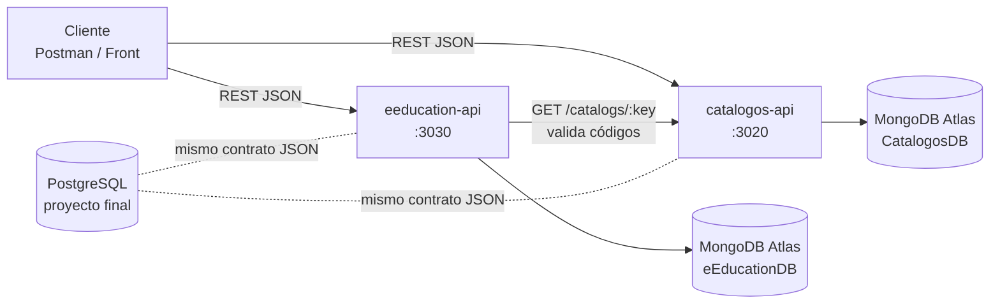

# Laboratorio de Servicios Web — Equipo 4

Guía y código de referencia de la materia **Laboratorio de Servicios Web** (ISC, Instituto Tecnológico de Tepic).
Unidad 1: *Infraestructura Web REST API* con **Node.js + Express + MongoDB Atlas**, más el diseño relacional en **PostgreSQL** para el proyecto final.

> Si eres nuevo en el equipo o en la materia, empieza por [docs/00-empieza-aqui.md](docs/00-empieza-aqui.md).

## ¿Qué hay en este repositorio?

El docente dejó dos actividades distintas según la experiencia del equipo. Aquí están **las dos, separadas**, para que nadie se revuelva:

| Carpeta | Para quién | Qué es | Puerto |
|---|---|---|---|
| [`catalogos-api/`](catalogos-api) | Integrantes que **ya llevaron clase** con el docente | Catálogo de catálogos (etiquetas → valores con N niveles) | 3020 |
| [`eeducation-api/`](eeducation-api) | Integrantes **nuevos** | *AppRESTeEducation*: Institutos y Productos/Servicios | 3030 |
| [`database/`](database) | Todos | Docker (Mongo y Postgres locales) + esquema SQL, datos de prueba y vistas | 27018 / 5433 |
| [`docs/`](docs) | Todos | Guías paso a paso, diseño de datos y flujo de trabajo en Git | — |

Las dos APIs son independientes (cada una arranca sola), pero se pueden conectar: `eeducation-api` valida sus códigos (giro, estatus, tipo de producto, tipo de archivo) preguntándole a `catalogos-api`. Ese es el ejemplo de **comunicación entre microservicios** del proyecto.



## Inicio rápido

Requisitos: Node.js 22+, Git y una cuenta de MongoDB Atlas (o Docker para trabajar en local).

```bash
git clone https://github.com/BetoCW/lab-servicios-web.git
cd lab-servicios-web/catalogos-api        # o eeducation-api
npm install
cp .env.example .env                      # en Windows: copy .env.example .env  -> y llena tus datos
npm run seed                              # carga datos de prueba
npm run dev                               # http://localhost:3020/api/v1/catalogs
```

Luego importa la colección de Postman de la carpeta `postman/` de cada proyecto.

## Stack

| Pieza | Uso |
|---|---|
| Express 5 | Servidor y rutas REST |
| Mongoose 9 | Modelos y esquemas sobre MongoDB |
| @hapi/boom | Errores HTTP (400, 404, 409…) |
| Babel 8 + nodemon | Sintaxis `import/export` y recarga automática en desarrollo |
| dotenv | Configuración por variables de entorno |
| Docker | MongoDB 8 y PostgreSQL 17 locales (opcional) |

## Arquitectura por capas (igual en los dos proyectos)

```
HTTP -> routes -> controllers -> services -> models (Mongoose) -> MongoDB
```

- **routes**: URL + método HTTP.
- **controllers**: leen `req`, llaman al service y responden con el código HTTP correcto. No tocan Mongoose.
- **services**: reglas de negocio (validaciones, borrado lógico, historial).
- **models**: esquemas e índices.
- **middlewares/errorHandler**: convierte cualquier error en una respuesta JSON clara.

## Ramas del equipo

`main` es la versión estable. Cada integrante trabaja en su rama y abre un Pull Request hacia `main`. Detalles en [docs/04-flujo-git.md](docs/04-flujo-git.md).

| Rama | Integrante |
|---|---|
| `ocegueda-antony` | Antony Daniel Ocegueda Ruelas |
| `perez-kevin` | Kevin Alberto Pérez Solís |
| `garcia-edgar` | Edgar Daniel García Vázquez |
| `garnica-gustavo` | Gustavo Adolfo Garnica Talavera |
| `cardenas-samir` | Samir Adrián Cárdenas Gámez |
| `camarena-jose` | José Alfredo Camarena Martínez |
| `castellanos-edwin` | Edwin Uriel Castellanos Machuca |

## Seguridad

- **Nunca** subas un archivo `.env` ni pegues una connection string con contraseña en el código, en capturas o en documentos. El `.gitignore` ya bloquea los `.env`.
- Si una contraseña de Atlas llegó a publicarse (en un PDF, un chat o un commit), cámbiala en *Atlas → Database Access → Edit Password*.
