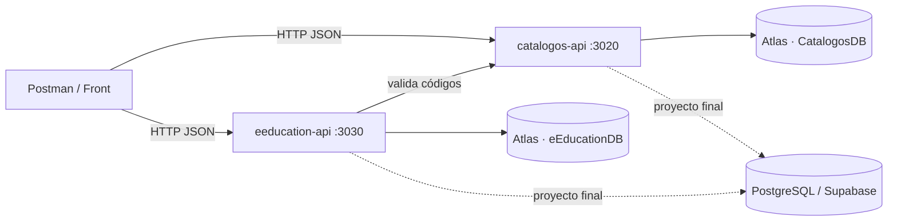
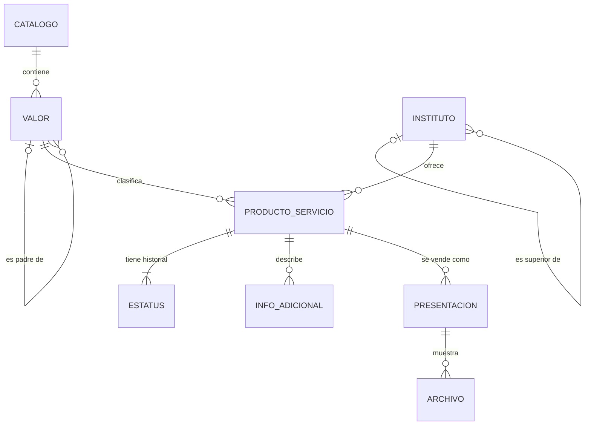

# 06 · Diseño de datos

Resumen técnico del modelo del proyecto. Las fuentes de los diagramas están en [`docs/diagramas`](diagramas) (GitHub dibuja los bloques Mermaid).

## Arquitectura



## Modelo conceptual



## Decisiones NoSQL (MongoDB)

| Decisión | Motivo |
|---|---|
| `values[]` **embebido** en `catalogs` | Se lee completo, cambia poco, es pequeño; el documento es la respuesta de la API |
| Jerarquía con `parentId` (árbol plano) | N niveles sin anidar subdocumentos; mover un valor es cambiar un campo |
| `Institutos` y `ProdServ` en **colecciones separadas** | Un instituto puede tener muchos productos que crecen sin límite; se consultan por separado |
| Presentaciones, estatus, info adicional y archivos **embebidos** en `ProdServ` | Siempre se muestran con su producto y pertenecen solo a él |
| `detail_row` en documento y subdocumentos | Auditoría y borrado lógico uniformes |
| Códigos (`Giro`, `IdTipoEstatusOK`…) como texto validado contra el catálogo | Desacopla los microservicios; no hay *joins* entre bases |

## Decisiones relacionales (PostgreSQL)

| Decisión | Motivo |
|---|---|
| `catalog_values` auto-referenciada | Jerarquía de N niveles con integridad (FK) |
| `UNIQUE (catalog_id, code)` | Igual al índice único `key + values.code` de Mongo |
| `UNIQUE NULLS NOT DISTINCT (catalog_id, parent_id, sequence)` | La secuencia única también se respeta en el nivel 1 (padre NULL) |
| Índices únicos parciales | Solo un estatus `actual = 'S'` y una presentación principal por producto |
| `bitacora` | Equivale a `detail_row_reg[]` |
| Vistas `v_catalogs_json` y `v_prod_serv_json` | Devuelven el **mismo contrato JSON** que MongoDB |

## Contrato canónico de un catálogo (idéntico en ambos motores)

```json
{
  "id": "…", "key": "file_type", "label": "Tipos de Archivo",
  "description": "…", "collection": "config", "section": "Digital",
  "sequence": 5, "imageUrl": "", "route": "/config/file-type",
  "active": true, "createdAt": "…", "updatedAt": "…",
  "values": [
    { "id": "…", "parentId": null, "code": "IMG", "value": "Imagen", "alias": "IMG", "sequence": 1 }
  ]
}
```

## Equivalencias Mongo ↔ Postgres

| MongoDB | PostgreSQL |
|---|---|
| `catalogs` | `catalogs` |
| `catalogs.values[]` | `catalog_values` |
| `Institutos` | `institutos` |
| `ProdServ` | `prod_serv` |
| `ProdServ.cat_prod_serv_estatus[]` | `prod_serv_estatus` |
| `ProdServ.cat_prod_serv_info_ad[]` | `prod_serv_info_ad` |
| `ProdServ.cat_prod_serv_presenta[]` | `prod_serv_presenta` |
| `…presenta[].cat_prod_serv_archivos[]` | `prod_serv_presenta_archivos` |
| `detail_row.Activo / Borrado` | columnas `activo` / `borrado` |
| `detail_row.detail_row_reg[]` | `bitacora` |
